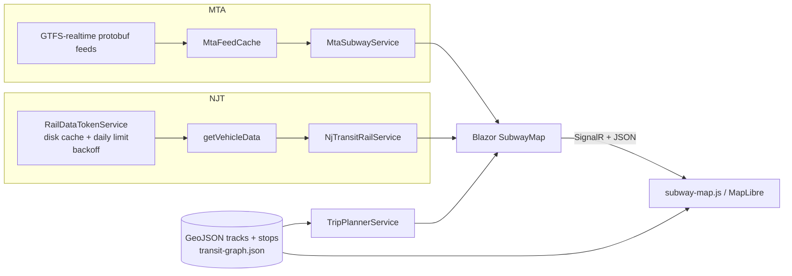

# NY · NJ Live Rail Map

Portfolio project: a single-page **live map** of NYC Subway and NJ Transit rail with MapLibre, unified train markers, and a simple trip planner across both networks.

## Features

- Real-time subway positions from MTA GTFS-realtime feeds
- NJ Transit rail vehicle locations (when RailData credentials are configured)
- Track geometry and station layers from bundled GeoJSON
- Trip planning via a prebuilt station graph (`Data/transit-graph.json`)
- Mobile-friendly slide-up panel
- Staggered polling: subway ~every 5s, NJ Rail ~every 20s (manual refresh updates both)

## Architecture



**MTA path:** `MtaFeedUrls` → cached protobuf → stop lookup → live markers.

**NJ path:** `getToken` (≤10/day) → cached token → `getVehicleData` → route mapping → markers.

**UI:** Blazor Server pushes marker updates to MapLibre; trip routes are drawn client-side from planner coordinates.

## Run locally

Requirements: [.NET 9 SDK](https://dotnet.microsoft.com/download)

```bash
dotnet restore
dotnet run
```

Open `http://localhost:5119` (or the URL shown in the terminal).

### API keys

Set secrets via environment variables or `dotnet user-secrets`:

| Variable | Purpose |
|----------|---------|
| `MTA_API_KEY` | MTA developer API key ([api.mta.info](https://api.mta.info/)) |
| `NJTRANSIT_USERNAME` / `NJTRANSIT_PASSWORD` | NJ Transit RailData account |

Without keys, the map still loads static layers; live feeds may be empty or show errors in the UI.

## Deploy (live demo)

This app is **ASP.NET Core Blazor Server** (SignalR + long-lived server). **Vercel is for static/serverless sites** and does not host this stack well.

Recommended for a portfolio live URL:

- **[Railway](https://railway.app)** or **[Render](https://render.com)** — deploy from this repo using the included `Dockerfile`, set the env vars above in the dashboard, and use port **8080**.

Use **GitHub** for the public source repo and link it from your portfolio. Host the running demo on Railway/Render and put that URL on your Vercel portfolio site as an external project link.

## Regenerate map data (optional)

Python scripts in `scripts/` rebuild GeoJSON and `Data/transit-graph.json` from GTFS inputs (see script headers). The repo ships generated assets so you can run the app without Python.

## License

MIT — map data © respective agencies (MTA, NJ Transit); follow their API terms when using live feeds.
